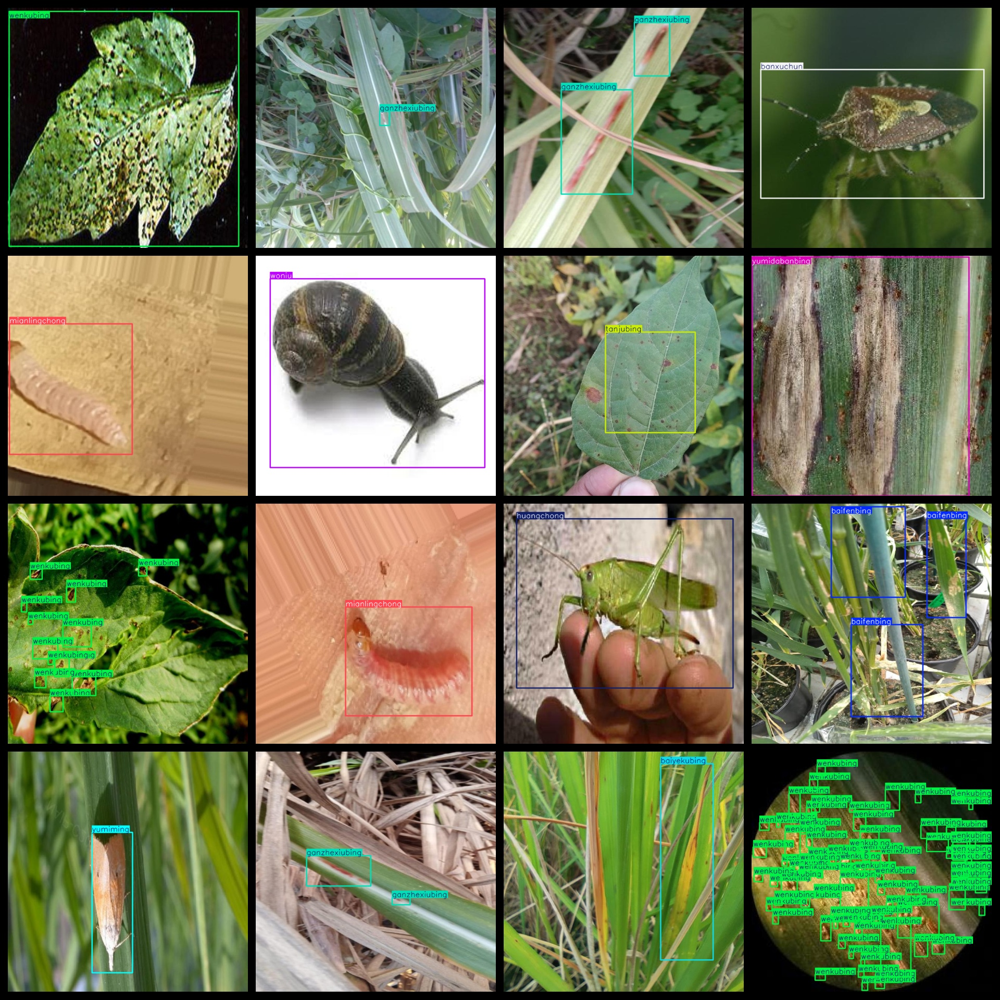

# The Crops Disease Detection Dataset consists of 5751 images in the VOC+YOLO format.

The Crops Disease Detection dataset consists of 5751 images in Pascal VOC and YOLO format. The dataset does not include split paths for the txt files but only contains jpg images along with their corresponding VOC-formatted xml files and YOLO-formatted txt files.

Number of images (jpg file counts): 5751
Number of annotations (xml file counts): 5751
Number of annotations (txt file counts): 5751
Number of annotation categories: 14

Repository where the dataset can be found: datasets_sl

Annotation category names based on the order in labels folder's classes.txt file: ["baifenbing", "baiyekubing", "banxuchun", "ganzhexiubing", "huangchong", "jima", "mianlingchong", "tanjubing", "wenkubing", "woniu", "yachong", "yumidabanbing", "yumiming", "yumixiubing"]

Box count for each category:

Baifenbing boxes = 691
Baiyekubing boxes = 448
Banxuchun boxes = 450
Ganzhexiubing boxes = 795
Huangchong boxes = 266
Jima boxes = 602
Mianlingchong boxes = 355
Tanjubing boxes = 497
Wenkubing boxes = 4391
Woniu boxes = 625
Yachong boxes = 609
Yumidabanbing boxes = 508
Yumimibing boxes = 560
Yuxixiubing boxes = 548
Total box count: 11345

Images per category:

Baifenbing images = 242
Baiyekubing images = 406
Banxuchun images = 434
Ganzhexiubing images = 491
Huangchong images = 242
Jima images = 322
Mianlingchong images = 355
Tanjubing images = 375
Wenkubing images = 483
Woniu images = 512
Yachong images = 435
Yumidabanbing images = 486
Yumimibing images = 500
Yuxixiubing images = 468
Image resolution: 640x640
Annotation tool used: labelImg
Dataset is enhanced: Yes
Annotation rules: Draw a bounding box around the category
Important Note: The dataset does not contain training, validation, or test sets to be divided; users must divide them themselves.
Special Remark: This dataset does not guarantee any accuracy in the trained models or weight files.

## Images

---

Here is a pay link on Stripe (https://buy.stripe.com/3cs8yP7sY87d0vu9AB). Please contact me lonlonago@foxmail.com after funding $89, and I will send you a complete data files, thank you!

